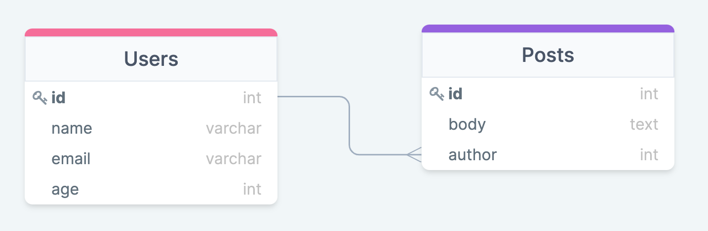
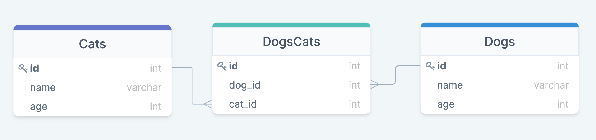

# Sequelize intro

## Как начинали работу

1.  `npm init -y` - инициализируем проект node
1.  `npm i sequelize pg pg-hstore` - устанавливаем зависимости postgres
1.  `npm i -D sequelize-cli` - устанавливаем sequelize cli
1.  создаём файл `.sequelizerc`:

```Javascript
 const path = require('path');
 module.exports = {
 'config': path.resolve('config', 'config.json'),
 'models-path': path.resolve('db', 'models'),
 'seeders-path': path.resolve('db', 'seeders'),
 'migrations-path': path.resolve('db', 'migrations')
 };
```

1. `npx sequelize-cli init` - создаём структуру для работы с sequelize
1. В файле `config.json` изменили данные для БД (username, password, database, dialect) на свои. Обратите внимание, что мы ввели разные данные для development и test
1. Для того, чтобы sequelize следил за сидерами (не накатывались те сидеры, которые уже были добавлены в БД, аналогично миграциям),в файл `config.json` добавили строчки

```
    "seederStorage": "sequelize",
    "seederStorageTableName": "SequelizeData"
```

## Что сделали

1.  Создали модель командой `npx sequelize-cli model:generate --name User --attributes firstName:string,lastName:string,email:string` (изменили под себя)
    - Одновременно с этим создалась миграция
    - **Если поменяли что-то в модели - меняем и в миграции**
1.  Накатили миграцию `npx sequelize-cli db:migrate`
1.  Создали seeder командой `npx sequelize-cli seed:generate --name demo-user` (изменили под себя)

## На что обратить внимание

1.  Когда пишем seeder, поля `createdAt` и `updatedAt` нужно заполнить самому `new Date()`

### Связи

**_Важно_**

Если в миграции вы указываете, что какое-то поле _таблицы А_ ссылается на _Таблицу В_, то на момент накатывания миграции с _Таблицей А_, уже должна существовать _Таблица В_. В обратном случае, вы получите ошибку `Table_name is not exist`.

  
_Таблица 1_. Связь One-to-Many.

1.  Чтобы создать связь (один ко многим), нужно:

    - в модели `Post`:

    ```JavaScript
         static associate(models) {
             this.belongsTo(models.User, {
                foreignKey: 'author',
             });
             }
    ```

    - в модели `User`:

    ```JavaScript
         static associate(models) {
            this.hasMany(models.Post, {
            foreignKey: 'author',
          });
          }
    ```

    - в миграции `create-post`:

    ```JavaScript
          author: {
          type: Sequelize.INTEGER,
          allowNull: false,
          references: {
              model: {
                  tableName: 'Users',
              },
          key: 'id',
          },
          }
    ```

## Миграции

Чтобы добвить новое поле в таблицу, нужно:

1. Создать миграцию командой `npx sequelize-cli migration:create --name new_column_in_user`

1. Изменить миграцию с использованием

   `JavaScript queryInterface.addColumn `

   и

   `queryInterface.removeColumn`

1. Добавить новое поле в модель `User`
1. Запустить миграцию `npx sequelize-cli db:migrate`


## Many to many

Для этого примера создан отдельный файл `appMany.js`, и отдельная бд, которая описана в файле config.json в части test. Чтобы запустить этот файл, нужно воспользоваться скриптом `npm run many`

### Идея

Есть три таблицы: Dogs, Cats и DogsCats. Многие собаки могут дружить с многими кошками. Связь между кошками и собаками описывается в таблице `Dogscats`.

  
_Таблица 1_. Связь Many-to-Many.

### Модели

1. В модели Dogs нужно описать связь с многими котами через промежуточную таблицу:

   ```Javascript
   this.belongsToMany(Cat, { through: 'Dogscats', foreignKey: 'dog_id' });
   ```

1. В модели Cats нужно сделать аналогичную связь:

   ```Javascript
     this.belongsToMany(Dog, { through: 'Dogscats', foreignKey: 'cat_id' });
   ```

1. В модели Dogscats _ничего делать не нужно_

### Миграции

1. В миграции `dogscats` указываем, что столбцы `cat_id` и `dog_id` ссылаются на таблицы `Cats` и `Dog` соответсвенно

   ```Javascript
        dog_id: {
       type: Sequelize.INTEGER,
       references: {
         model: 'Dogs', // tableName
         key: 'id',
       },
        },
        cat_id: {
        type: Sequelize.INTEGER,
        references: {
         model: 'Cats', // tableName
         key: 'id',
       },
       },
   ```

1. В миграциях `Cats` и `Dogs` ничего делать не нужно
